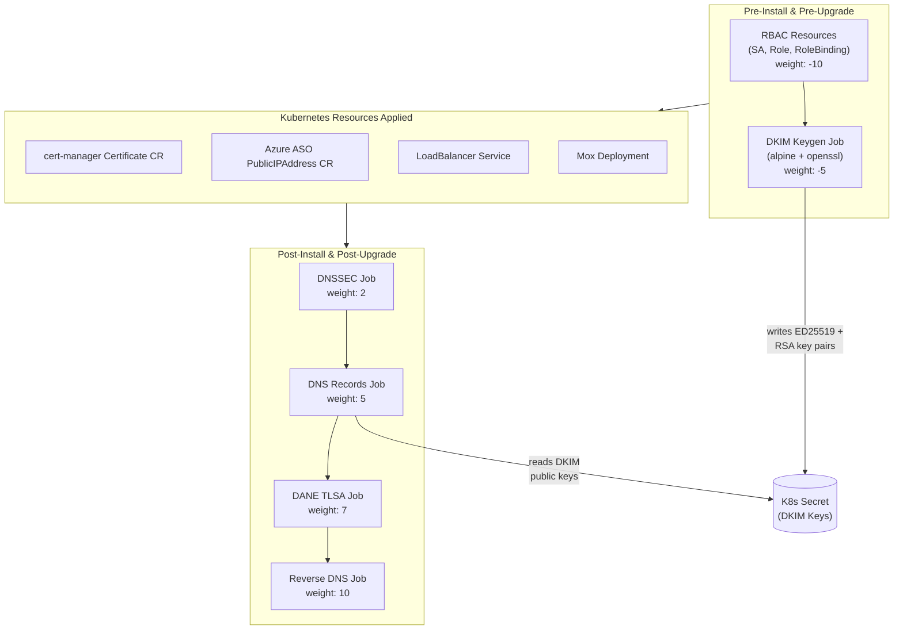
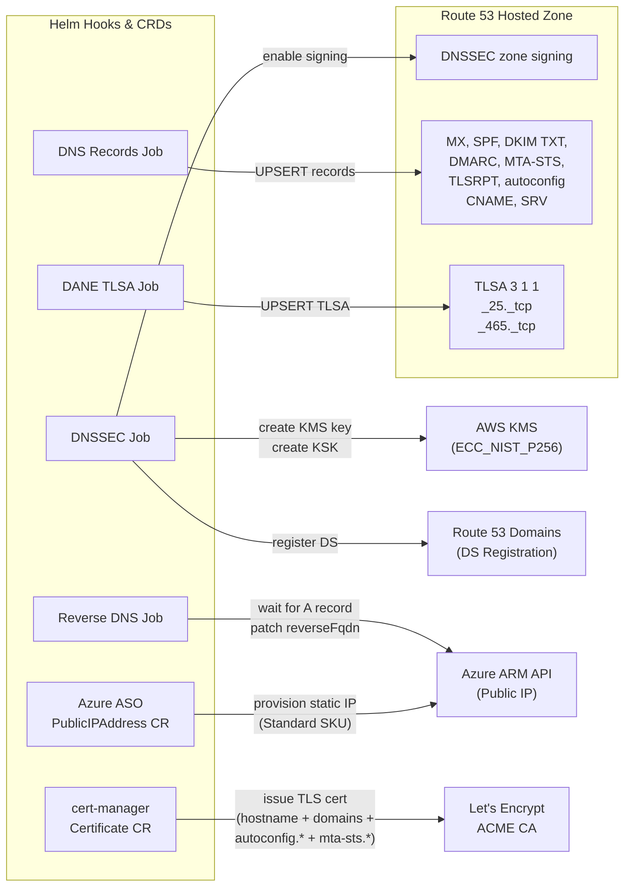
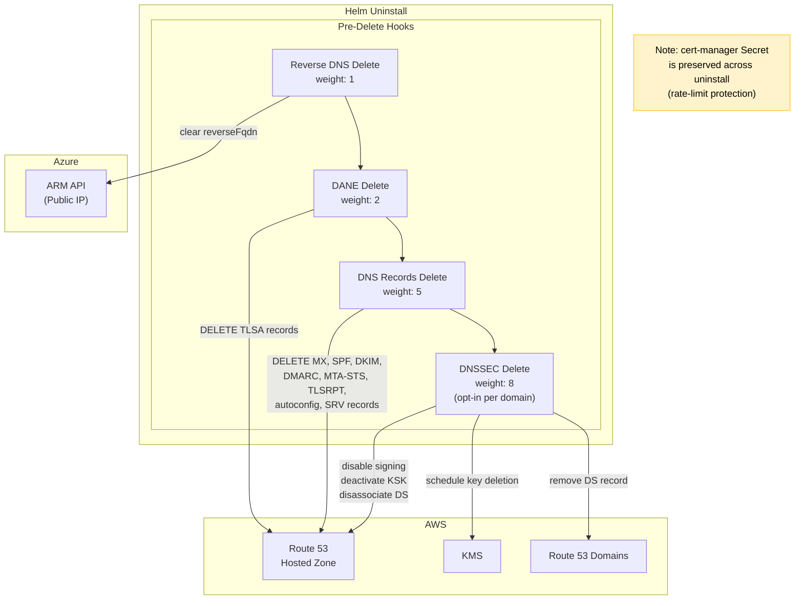
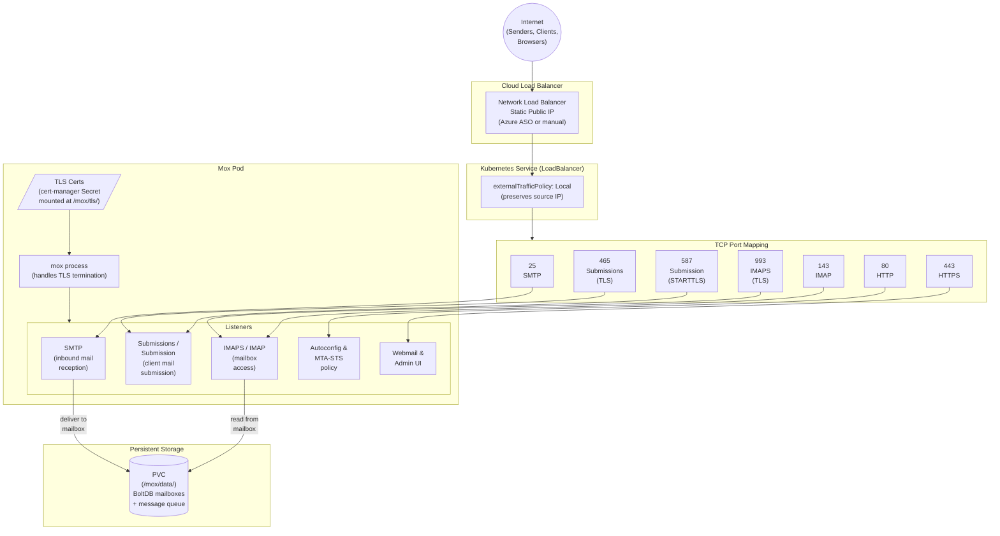
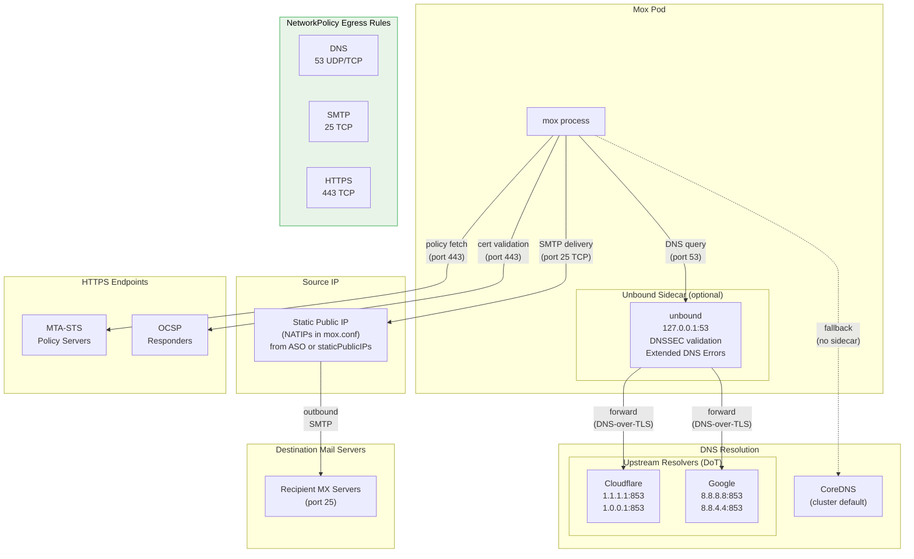

# Mox Helm Chart — Architecture Diagrams

## 3rd-Party Provider Automation

The chart uses Helm lifecycle hooks and Kubernetes CRDs to orchestrate external
providers during install, upgrade, and uninstall. Jobs execute in the order
determined by their hook-weight annotations.

### Install / Upgrade

#### Hook Execution Order

Hooks run sequentially by weight. Pre-install hooks generate DKIM keys and
store them in a Kubernetes Secret. Post-install hooks read those keys and
provision external resources.

#### External Provider Interactions

Each hook and CRD targets a specific external provider to automate
infrastructure that a mail server depends on.

### Uninstall

Cleanup hooks run in ascending weight order before resources are deleted.

## Inbound Traffic Flow

All mail and web traffic enters through a single `LoadBalancer` Service with
`externalTrafficPolicy: Local` to preserve the original client IP (required for
SPF validation and abuse tracking). TLS terminates at the mox process, not the
load balancer.

## Outbound Traffic Flow

Mox delivers outbound mail directly over SMTP port 25. A DNSSEC-validating
Unbound sidecar provides authenticated DNS resolution with Extended DNS Error
reporting. The static public IP (from Azure ASO or `staticPublicIPs`) is
configured as a NAT IP so receiving servers see a consistent, PTR-verified
source address.

